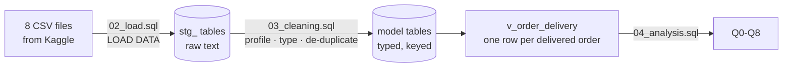

# Delivered Late, Rated Low

Delivery performance and customer satisfaction in Brazilian e-commerce: a MySQL analysis of 99,441 orders.


**Key finding:** a late delivery turns a 4.3-star customer into a 2.3-star one.
Fewer than 7% of orders arrive late, but those orders are almost seven times as
likely to get a 1 or 2-star review. In 72% of late orders the seller shipped on
time, so the delay happened in transit.

---

## Results at a glance

| Metric | Result |
|---|---|
| Scale | 99,441 orders · 96,096 customers · 3,095 sellers · Sep 2016 to Oct 2018 |
| Delivered orders arriving after the promised date | 6.8% |
| Average review, late vs on time | 2.27 vs 4.29 stars |
| 1-2 star reviews, late vs on time | 62.4% vs 9.3% |
| Late orders where the seller handed over on time | 72.2% (the delay was in transit) |
| Sellers responsible for half of all late orders | 98 of 2,948 (3.3%) |
| Worst month | March 2018: 19.0% late, average rating 3.81 |
| Freight as a share of product value | 26.3% in Maranhão vs 13.9% in São Paulo |
| Customers who ever ordered twice | 3.1% |

---

## The data

The public Brazilian E-Commerce dataset released by Olist, a Brazilian online
marketplace. It holds real, anonymised orders from 2016 to 2018 across eight
related tables: orders, items, payments, reviews, customers, products, sellers
and category names. It is the same data used in Scaler's *Target Brazil* SQL
case study, but the questions here are different from that brief.

The data is not included in this repository. See [`data/README.md`](data/README.md)
for where to download it.

---

## The questions

| # | Question | Why it matters |
|---|---|---|
| Q1 | Does a late delivery hurt the review score? | Ratings drive repeat orders and search ranking |
| Q2 | Where does freight eat the margin? | Decides which regions are worth serving |
| Q3 | How many customers ever come back? | Tests whether retention is a lever at all |
| Q4 | Who are the valuable customers, when almost nobody buys twice? | Targets marketing spend |
| Q5 | Which categories earn well but get poor ratings? | Shows merchandising where to act |
| Q6 | Is delivery against the promise getting better or worse? | Trend on the operational metric, not just volume |
| Q7 | When an order is late, is it the seller or the carrier? | Decides who has to fix it |
| Q8 | Are late deliveries concentrated in a few sellers? | Makes the fix targeted |

---

## Approach



| Step | What happens | File |
|---|---|---|
| Stage | Each CSV is loaded as-is into a text-only table, so no row is lost to a bad value | [`01_schema.sql`](sql/01_schema.sql), [`02_load.sql`](sql/02_load.sql) |
| Profile | Data problems are counted before anything is changed | [`03_cleaning.sql`](sql/03_cleaning.sql) section 1 |
| Clean and model | Typed columns, primary and foreign keys, one review per order | [`03_cleaning.sql`](sql/03_cleaning.sql) sections 2-3 |
| Analyse | A delivery view, then one query block per question | [`04_analysis.sql`](sql/04_analysis.sql) |

### Data problems and how they were handled

| Problem | Size | Handling |
|---|---:|---|
| `customer_id` is issued per order; the person is `customer_unique_id` | 2,997 people have several ids | Customers counted by `customer_unique_id` (Q3 shows that counting by `customer_id` gives 0% repeat) |
| Orders with more than one review | 547 | Latest review per order kept (`ROW_NUMBER`) |
| Review ids reused across orders | 789 | Reviews keyed on order, not review id |
| Products with no category | 610 | Kept, but left out of the category analysis |
| Categories with no English name | 2 | Portuguese name used instead |
| "Delivered" orders with no delivery date | 8 | Left out of delivery metrics |
| Line endings differ between files: LF in six, Windows CR LF in two | 2 of 8 files | Line terminator set per file in `02_load.sql` |

An order is **late** if it was delivered after the estimated delivery date the
customer saw at checkout. Delivery on that date counts as on time.

---

## Findings

### 1. Customers react to missing the promised date, not to speed

| Delivered | Orders | Avg review | 1-2 stars | 5 stars |
|---|---:|---:|---:|---:|
| Early by 11+ days | 56,905 | 4.32 | 9.0% | 64.1% |
| Early by 4-10 days | 26,553 | 4.26 | 9.4% | 60.3% |
| Early by 1-3 days | 4,705 | 4.13 | 11.2% | 55.1% |
| On the promised day | 1,280 | 4.03 | 12.4% | 50.6% |
| Late by 1-5 days | 2,722 | 2.99 | 41.1% | 28.3% |
| Late by 6-15 days | 2,479 | 1.74 | 78.2% | 7.9% |
| Late by 16+ days | 1,180 | 1.73 | 78.3% | 7.5% |

Arriving early raises the rating only slightly. Missing the promised date by
even a day or two drops it by more than a full star, so the promised date
matters as much as the delivery itself.

### 2. Most late orders are delayed in transit, and a few sellers cause most of the rest

| Late orders | Count | Share | Avg days late |
|---|---:|---:|---:|
| Seller handed over on time (delay in transit) | 4,719 | 72.2% | 10.9 |
| Seller handed over late | 1,814 | 27.8% | 9.8 |

On single-seller orders, 98 sellers (3.3% of 2,948) account for half of all late
deliveries. The worst sellers with 50+ orders are late on 17-31% of them,
against 6.8% across the marketplace.

### 3. Deliveries fell behind during the 2017-18 peak

| Month | Delivered orders | Avg delivery days | Late | Avg review |
|---|---:|---:|---:|---:|
| Oct 2017 | 4,478 | 11.7 | 4.2% | 4.20 |
| Nov 2017 (Black Friday) | 7,288 | 15.1 | 12.4% | 3.99 |
| Feb 2018 | 6,555 | 16.9 | 14.1% | 3.88 |
| Mar 2018 | 7,003 | 16.2 | 19.0% | 3.81 |
| Jun 2018 | 6,096 | 9.2 | 1.2% | 4.31 |
| Aug 2018 | 6,351 | 7.7 | 6.2% | 4.31 |

Orders rose 63% from October to November 2017, and deliveries did not catch up
until April. The monthly rating follows the late rate closely. In most months
orders arrive 8-13 days before the promised date, so the promise has slack built
in, but that was not enough during the peak.

### 4. Remote regions pay nearly double in freight and wait longer

| State | Orders | Freight / product value | Avg delivery days | Late |
|---|---:|---:|---:|---:|
| Maranhão (MA) | 717 | 26.3% | 21.5 | 17.4% |
| Rondônia (RO) | 243 | 24.7% | 19.3 | 2.9% |
| Amazonas (AM) | 145 | 24.5% | 26.4 | 2.8% |
| Alagoas (AL) | 397 | 19.4% | 24.5 | 21.4% |
| São Paulo (SP) | 40,501 | 13.9% | 8.7 | 4.5% |

In the North and Northeast, freight adds a fifth to a quarter of the price, and
delivery takes two to three times as long as in São Paulo.

### 5. Very few customers come back

Only 3.1% of customers ever placed a second order (counting by `customer_id`
would wrongly show 0%). With repeat purchases this rare, frequency tells almost
nothing, so customers are segmented by recency and spend instead of full RFM:

| Segment | Customers | Share of revenue | Avg spend |
|---|---:|---:|---:|
| Repeat buyers | 2,801 | 5.6% | 308.59 |
| Recent high spenders | 14,404 | 28.2% | 302.17 |
| Lapsed high spenders | 13,786 | 27.5% | 307.75 |
| Recent low spenders | 21,737 | 10.3% | 72.93 |
| Other one-time buyers | 40,629 | 28.4% | 107.75 |

### 6. Large categories with below-average ratings

Among the 20 highest-revenue categories, three are rated below the marketplace
average: office furniture (3.64 stars, with a 20.6-day average delivery, the
slowest of the twenty), bed, bath & table (third-largest by revenue, 4.00) and
telephony (4.05).

---

## Recommendations

| # | Action | Evidence |
|---|---|---|
| 1 | Renegotiate carrier service levels on long-haul routes, starting with the North and Northeast | 72% of late orders were handed over on time; remote states wait 2-3x longer |
| 2 | Put the 98 worst sellers on a delivery scorecard, with faster hand-over or reduced visibility | 3.3% of sellers cause half of late deliveries |
| 3 | Plan carrier capacity for Black Friday through March | Late rate went from about 4% to 12-19% and ratings fell to 3.8 |
| 4 | Warn customers before the promised date passes, not after | Ratings drop sharply as soon as an order is late, even by 1-5 days |
| 5 | Win back the 13,786 lapsed high spenders | 27.5% of revenue comes from customers who have not returned |
| 6 | Set longer, realistic delivery promises for office furniture, or fix its logistics | Slowest delivery and lowest rating among the top categories |

---

## SQL techniques

| Technique | Used for |
|---|---|
| Staging tables, then a typed model with primary and foreign keys | A load that cannot silently lose or duplicate rows |
| `ROW_NUMBER()` | Keeping the latest review when an order has several |
| `CAST`, `STR_TO_DATE`, `NULLIF` | Converting staging text into dates and numbers, and empty fields into `NULL` |
| A view (`v_order_delivery`) | One definition of "late" reused by every question |
| `CASE` bucketing, conditional aggregation | Delivery buckets; late, 1-2 star and 5 star rates |
| `NTILE` | Recency and spend quintiles for segmentation |
| Running `SUM() OVER (ORDER BY ...)` | Pareto of late deliveries by seller |
| `SUM(COUNT(*)) OVER ()` | Shares of the total in a single pass |
| `DATE_FORMAT`, `DATEDIFF` | Monthly trends; days early or late against the promise |
| Temporary table | Reusing an intermediate result across two queries |

### Notes from loading the data

The Kaggle files are less uniform than they look. Six end their lines with `\n`
and two with Windows `\r\n`, and the wrong setting makes the load fail. Some
review comments contain a backslash, which MySQL treats as an escape character
unless the load says `ESCAPED BY ''`. `LOAD DATA` also stores empty fields as
`''` rather than `NULL`, so the cleaning script converts them with `NULLIF`
before parsing any date or number.

---

## Verification

| Check | Result |
|---|---|
| All eight files loaded, row for row | 99,441 orders · 112,650 items · 103,886 payments · 99,224 reviews · 99,441 customers · 32,951 products · 3,095 sellers · 71 categories |
| Rows lost between raw and model | 0, apart from 551 duplicate reviews removed on purpose |
| Orders delivered before they were bought | 0 |
| Payments vs items + freight, whole dataset | Payments are 1.04% higher (249 orders differ by more than 1, likely instalment charges) |

---

## Repository structure

```
ecommerce-delivery-satisfaction-sql/
├── sql/
│   ├── 01_schema.sql       database, staging tables, typed model
│   ├── 02_load.sql         loads the CSV files into staging (LOAD DATA)
│   ├── 03_cleaning.sql     data-quality profile, cleaning, checks
│   └── 04_analysis.sql     delivery view and questions Q0-Q8
└── data/
    └── README.md           where to download the dataset
```

---

## Running it

**Requirements:** MySQL 8.0 or later, and MySQL Workbench. The queries use
window functions and CTEs, which MySQL 5.7 does not support.

1. Download the dataset from Kaggle (see [`data/README.md`](data/README.md)).
2. Copy the eight CSV files into the MySQL upload folder. On Windows this is
   usually `C:\ProgramData\MySQL\MySQL Server 8.0\Uploads\`. To check,
   run `SHOW VARIABLES LIKE 'secure_file_priv';` and, if the folder is
   different, update the paths in `02_load.sql`.
3. In MySQL Workbench, open and run each script in order:

| Script | What it does |
|---|---|
| `sql/01_schema.sql` | Creates the `olist_analytics` database and empty tables |
| `sql/02_load.sql` | Loads the CSV files into staging and shows the row counts |
| `sql/03_cleaning.sql` | Profiles the raw data, cleans it into the model, runs checks |
| `sql/04_analysis.sql` | Answers Q0-Q8 |

The whole run takes under a minute.

---

## Author

**Harshal Goel**, Data & MIS Analyst ·
[harshalgoel9@gmail.com](mailto:harshalgoel9@gmail.com)

Also see: [Madhusudan Ghee sales analysis](https://github.com/harshalgoel9-droid/madhusudhan-analytics),
which asks whether a distributor's growth comes from price or volume, using
Python, MySQL and Tableau.

The code in this repository is MIT-licensed. The Olist dataset is published on
Kaggle under its own licence; see the dataset page for its terms.
