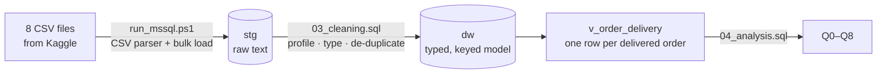

# Delivered Late, Rated Low

### Delivery performance and customer satisfaction in Brazilian e-commerce — a SQL Server analysis of 99,441 orders


> **The finding in one line:** a late delivery turns a 4.3-star customer into a
> 2.3-star one. Fewer than 7% of orders arrive late, yet they are **almost seven
> times as likely to earn a 1- or 2-star review** — and in 72% of late orders
> the seller shipped on time: the delay happened in transit.

**Contents** ·
[Results](#results-at-a-glance) ·
[Data](#the-data) ·
[Questions](#the-questions) ·
[Approach](#approach) ·
[Findings](#findings) ·
[Recommendations](#recommendations) ·
[Techniques](#sql-techniques) ·
[Verification](#verification) ·
[Run it](#run-it-yourself)

---

## Results at a glance

| Metric | Result |
|---|---|
| Scale | 99,441 orders · 96,096 customers · 3,095 sellers · Sep 2016 – Oct 2018 |
| Delivered orders arriving after the promised date | **6.8%** |
| Average review — late vs on time | **2.27 vs 4.29** stars |
| 1–2 star reviews — late vs on time | **62.4% vs 9.3%** |
| Late orders where the seller handed over on time | **72.2%** — the delay was in transit |
| Sellers responsible for half of all late orders | **98 of 2,948 (3.3%)** |
| Worst month | **March 2018: 19.0% late**, average rating 3.81 |
| Freight as a share of product value | **26.3%** in Maranhão vs **13.9%** in São Paulo |
| Customers who ever ordered twice | **3.1%** |

---

## The data

The public **Brazilian E-Commerce dataset released by Olist**, a Brazilian
online marketplace: real, anonymised orders from 2016 to 2018 across eight
related tables (orders, items, payments, reviews, customers, products,
sellers, category names). It is the same data used in Scaler's *Target
Brazil* SQL case study; the questions here go **beyond that brief**.

The data is **not included** in this repository. Download it from Kaggle — see
[`data/README.md`](data/README.md).

---

## The questions

| # | Question | Why it matters |
|---|---|---|
| Q1 | Does a late delivery destroy the review score? | Ratings drive repeat custom and search ranking |
| Q2 | Where does freight eat the margin? | Decides which regions are worth serving |
| Q3 | How many customers ever come back? | Tests whether retention is a lever at all |
| Q4 | Who are the valuable customers, when almost nobody buys twice? | Targets marketing spend |
| Q5 | Which categories earn well but disappoint? | Tells merchandising where to act |
| Q6 | Is the delivery promise getting better or worse? | Trend on the operational metric, not just volume |
| Q7 | When an order is late, is it the seller or the carrier? | Decides who has to fix it |
| Q8 | Are late deliveries concentrated in a few sellers? | Makes the fix targeted instead of blanket |

---

## Approach



| Step | What happens | File |
|---|---|---|
| Stage | Each CSV lands untouched in a text-only table, so no row is lost to a bad value | [`01_schema.sql`](sql/01_schema.sql), [`02_load.sql`](sql/02_load.sql) |
| Profile | The data's traps are counted before anything is changed | [`03_cleaning.sql`](sql/03_cleaning.sql) §1 |
| Clean and model | Typed columns, primary and foreign keys, one review per order | [`03_cleaning.sql`](sql/03_cleaning.sql) §2–3 |
| Analyse | A delivery view, then one query block per question | [`04_analysis.sql`](sql/04_analysis.sql) |

**Traps in this dataset, and how they were handled**

| Trap | Size | Handling |
|---|---:|---|
| `customer_id` is issued per **order** — the person is `customer_unique_id` | 2,997 people have several ids | Customers counted by `customer_unique_id` (Q3 shows the wrong way gives 0% repeat) |
| Orders with more than one review | 547 | Latest review per order kept (`ROW_NUMBER`) |
| Review ids reused across orders | 789 | Reviews keyed on order, not review id |
| Products with no category | 610 | Kept; excluded only from category analysis |
| Categories with no English name | 2 | Fall back to the Portuguese name |
| "Delivered" orders with no delivery date | 8 | Excluded from delivery metrics |
| Numbers exported as text (`1.0`), mixed timestamp formats | — | `TRY_CAST` / `TRY_CONVERT`, empty strings made `NULL` first |

**"Late"** means delivered after the estimated delivery **date** the customer
was shown at checkout. Delivered on that day counts as on time.

---

## Findings

### 1. Being late is a cliff, not a slope

| Delivered | Orders | Avg review | 1–2 stars | 5 stars |
|---|---:|---:|---:|---:|
| Early by 11+ days | 56,905 | 4.32 | 9.0% | 64.1% |
| Early by 4–10 days | 26,553 | 4.26 | 9.4% | 60.3% |
| Early by 1–3 days | 4,705 | 4.13 | 11.2% | 55.1% |
| On the promised day | 1,280 | 4.03 | 12.4% | 50.6% |
| **Late by 1–5 days** | 2,722 | **2.99** | **41.1%** | 28.3% |
| **Late by 6–15 days** | 2,479 | **1.74** | **78.2%** | 7.9% |
| **Late by 16+ days** | 1,180 | **1.73** | **78.3%** | 7.5% |

Arriving early only nudges the rating up; missing the promise by even a day or
two knocks off more than a full star. **Customers judge the promise, not the
speed** — so the promised date is as important a lever as the delivery itself.

### 2. Most late orders are a transit problem — and a few sellers cause most of the rest

| Late orders | Count | Share | Avg days late |
|---|---:|---:|---:|
| Seller handed over **on time** — delay in transit | 4,719 | **72.2%** | 10.9 |
| Seller handed over late | 1,814 | 27.8% | 9.8 |

On single-seller orders, **98 sellers (3.3% of 2,948) account for half of all
late deliveries**. The worst sellers with 50+ orders are late on 17–31% of them,
against 6.8% across the marketplace.

### 3. The network broke under the 2017–18 peak

| Month | Delivered orders | Avg delivery days | Late | Avg review |
|---|---:|---:|---:|---:|
| Oct 2017 | 4,478 | 11.7 | 4.2% | 4.20 |
| **Nov 2017** (Black Friday) | **7,288** | 15.1 | **12.4%** | 3.99 |
| Feb 2018 | 6,555 | 16.9 | **14.1%** | 3.88 |
| **Mar 2018** | 7,003 | 16.2 | **19.0%** | **3.81** |
| Jun 2018 | 6,096 | 9.2 | 1.2% | 4.31 |
| Aug 2018 | 6,351 | 7.7 | 6.2% | 4.31 |

Orders jumped 63% from October to November 2017 and the delivery network did
not keep up until April. The monthly rating tracks the late rate almost
exactly. In most months orders arrive 8–13 days *before* the promised date, so
the promise is padded — and still was not enough in the peak.

### 4. Remote regions pay nearly double in freight — and wait longer

| State | Orders | Freight / product value | Avg delivery days | Late |
|---|---:|---:|---:|---:|
| Maranhão (MA) | 717 | **26.3%** | 21.5 | 17.4% |
| Rondônia (RO) | 243 | 24.7% | 19.3 | 2.9% |
| Amazonas (AM) | 145 | 24.5% | 26.4 | 2.8% |
| Alagoas (AL) | 397 | 19.4% | 24.5 | **21.4%** |
| São Paulo (SP) | 40,501 | **13.9%** | **8.7** | 4.5% |

In the North and Northeast, freight adds a fifth to a quarter of the price and
delivery takes two to three times as long as in São Paulo.

### 5. Almost nobody comes back — so first impressions are everything

Only **3.1%** of customers ever placed a second order (counting by
`customer_id` instead would wrongly show 0%). With repeat purchase this rare,
segmenting by recency and spend is more useful than classic RFM:

| Segment | Customers | Share of revenue | Avg spend |
|---|---:|---:|---:|
| Repeat buyers | 2,801 | 5.6% | 308.59 |
| Recent high spenders | 14,408 | 28.2% | 302.30 |
| **Lapsed high spenders** | **13,781** | **27.5%** | 307.70 |
| Recent low spenders | 21,731 | 10.3% | 72.93 |
| Other one-time buyers | 40,636 | 28.4% | 107.72 |

### 6. Big categories that disappoint

Among the 20 highest-revenue categories, three are rated below the marketplace
average: **office furniture** (3.64 stars, 20.6-day average delivery — the
slowest of the twenty), **bed, bath & table** (third-largest by revenue, 4.00)
and **telephony** (4.05).

---

## Recommendations

| # | Action | Evidence |
|---|---|---|
| 1 | Renegotiate carrier service levels on long-haul routes, starting with the North and Northeast | 72% of late orders were handed over on time; remote states wait 2–3× longer |
| 2 | Put the 98 worst sellers on a delivery scorecard — faster hand-over or reduced visibility | 3.3% of sellers cause half of late deliveries |
| 3 | Plan carrier capacity for Black Friday through March | Late rate went from ~4% to 12–19% and ratings fell to 3.8 |
| 4 | Warn customers **before** the promised date passes, not after | Ratings collapse the moment an order is late, even by 1–5 days |
| 5 | Win back the 13,781 lapsed high spenders | 27.5% of revenue from customers who have not returned |
| 6 | Set longer, honest promises for office furniture, or fix its logistics | Slowest delivery and lowest rating among top categories |

---

## SQL techniques

| Technique | Used for |
|---|---|
| Staging → typed model with primary and foreign keys | A load that cannot silently lose or duplicate rows |
| `ROW_NUMBER()` | Keeping one review per order; de-duplicating every table |
| `TRY_CAST` / `TRY_CONVERT` with `NULLIF` | Parsing text numbers and mixed timestamp formats safely |
| A view (`dw.v_order_delivery`) | One definition of "late" reused by every question |
| `CASE` bucketing, conditional aggregation | Delivery buckets; late / 1-2 star / 5 star rates |
| `NTILE` | Recency and spend quintiles for segmentation |
| Running `SUM() OVER (ORDER BY …)` | Pareto of late deliveries by seller |
| `SUM(COUNT(*)) OVER ()` | Shares of the total in a single pass |
| `DATETRUNC`, `DATEDIFF` | Monthly trends; days early or late against the promise |
| Temp tables | Reusing an intermediate result across two queries |

**A performance lesson, kept on purpose.** The first version of the cleaning
script compared staging ids (`NVARCHAR`) with the model's `CHAR(32)` keys. The
implicit conversion stopped SQL Server using the index, and loading the orders
ran for more than ten minutes. Casting the ids to `CHAR(32)` first let the key
lookups use the index: the whole cleaning script now runs in **under 30
seconds**.

---

## Verification

| Check | Result |
|---|---|
| All eight files loaded, row for row | 99,441 orders · 112,650 items · 103,886 payments · 99,224 reviews · 99,441 customers · 32,951 products · 3,095 sellers · 71 categories |
| Rows lost between raw and model | **0** — apart from 551 duplicate reviews removed by design |
| Orders delivered before they were bought | 0 |
| Payments vs items + freight, whole dataset | Payments are 1.04% higher (249 orders differ by more than 1; likely instalment charges) |

Outputs of the verified run are in [`sql/output/`](sql/output).

---

## Repository structure

```
ecommerce-delivery-satisfaction-sql/
├── sql/
│   ├── 01_schema.sql       database, staging tables, typed model
│   ├── 02_load.sql         pure T-SQL load (BULK INSERT), for SSMS
│   ├── 03_cleaning.sql     data-quality profile, cleaning, checks
│   ├── 04_analysis.sql     delivery view and questions Q0–Q8
│   └── output/             results of the verified run
├── scripts/
│   └── run_mssql.ps1       one command: build, load, clean, analyse
└── data/
    └── README.md           where to download the dataset
```

---

## Run it yourself

**Needs:** Windows and SQL Server 2022 or later (the free Developer or Express
edition) with `sqlcmd`.

1. Download the dataset from Kaggle and put the CSV files in `data/` — see
   [`data/README.md`](data/README.md).
2. Run:

```powershell
.\scripts\run_mssql.ps1
```

It builds the `OlistAnalytics` database, loads the files with a proper CSV
parser (some review comments span several lines), cleans the data and runs every
question. Output goes to `sql/output/`.

**From SQL Server Management Studio instead:** copy the CSV files to
`C:\Users\Public\OlistAnalytics\data\`, then open `sql/01` to `sql/04` in order
and press F5 on each.

---

## Author

**Harshal Goel** — Data & MIS Analyst ·
[harshalgoel9@gmail.com](mailto:harshalgoel9@gmail.com)

Also see: [FMCG sales, pricing & receivables analytics](https://github.com/harshalgoel9-droid/madhusudhan-analytics)
— a SQL Server warehouse, Excel MIS pack and Tableau dashboards.

The code in this repository is MIT-licensed. The Olist dataset is published on
Kaggle under its own licence; see the dataset page for its terms.
